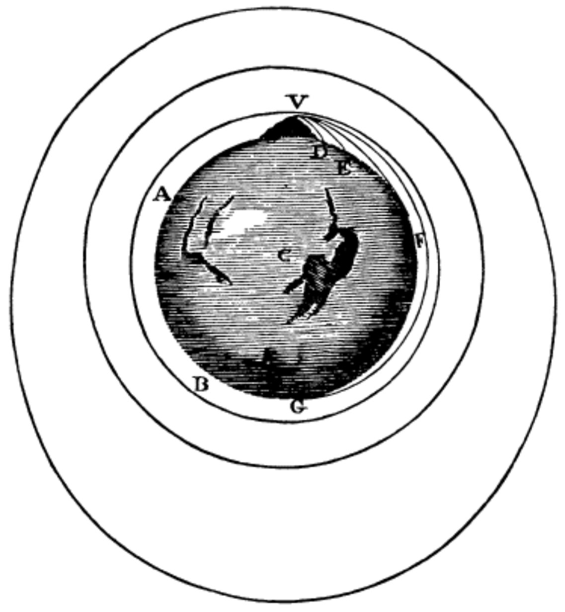

## From Galileo to Newton Daily Schedule Term 2

Course [home page](./)

See also: [Daily Schedule Term 3](./daily_schedule_term_3.html)

### Week 1 &mdash; Euclid's Understanding of Ratios &mdash; Galileo's Understanding of Uniform Motion

* Preparation for Tuesday, Aug. 30 &mdash; In a footnote, you will see that Galileo relies upon Book V Definition 5 of Euclid regarding proportionality. Here is an image of the [first page of Book V](./resources/EuclidBookVDefinition5.jpeg). Read the first six definitions critically in tandem with reading the first three theorems. In addition to being prepared to discuss the reading, create example problems with numbers that illustrate what Galileo is saying. 2-3 problems on one page would be a good amount. I will step out and photocopy them. We will spend a bunch of class time solving a selection of each others' problems. In these problems try to avoid using *d = v t*. That is not how any of Euclid, Galileo, or Newton write. Instead, they write in terms of ratios. The illustrative problems you create to share with one another should therefore also be posed in terms of ratios.
* Tuesday, Aug. 30 &mdash; Euclid's Ratios &mdash; Begin Galileo's Uniform Motion &mdash; Some [Example Problems for Day 1](./resources/Day01Examples.pdf)
* Preparation for Thursday, Sep. 1 &mdash; Do the problems you prepared for one another on Theorems I to III &mdash; We won't hand those in, but we should discuss them &mdash; Read the remaining three theorems/propositions on Uniform Motion &mdash; Ben and Brian will present Theorem IV, Mishel and Sofia Theorem V, and Luke and Declan Theorem VI &mdash; A good idea would be to begin your presentation with an illustrative example including example units and numbers
* Thursday, Sep. 1 &mdash; Conclude Galileo's Uniform Motion &mdash; Ben and Brian's [Proof of Theorem IV](./proofs/Day02TheoremIV.pdf) (includes a summary of the first six theorems)

### Week 2 &mdash; Galileo's Understanding of Uniform Acceleration &mdash; Galilean Relativity &mdash; Begin Newton

* Preparation for Monday, Sep. 5 &mdash; Read Theorem I, Theorem II, and Corollary I (through p. 175) on uniform acceleration from [the second excerpt from Two New Sciences](./resources/DialoguesConcerningTwoNewSciences-Excerpt02.pdf)
* Preparation for Tuesday, Sep. 6 &mdash; Read Corollary II, Theorem III, and Theorem IV (through p. 187) on uniform acceleration from [the third excerpt from Two New Sciences](./resources/DialoguesConcerningTwoNewSciences-Excerpt03.pdf) &mdash; In addition, glance ahead to get a hint of where Galileo is going, even though we are about to part ways with *The Dialogues Concerning Two New Sciences,* and especially glance at the very next theorem, Theorem V &mdash; Finally, in addition, read this excerpt from Galileo's [Dialogue Concerning the Two Chief World Systems](./resources/DialogueConcerningTheTwoChiefWorldSystems-Excerpt.pdf).
* NB/Context: *The Dialogue Concerning the Two Chief World Systems,* published in 1632 is the book that got Galileo on trial. It was banned in 1633 and not permitted to be published in Catholic countries until 1835. Galileo makes many arguments with the ultimate conclusions being that the Earth revolves daily, it is in motion around the Sun, and that the Sun and the Moon raise the tides. The specific argument we are reading is an argument for what is now known as Galilean Relativity. The idea is that you cannot detect if you are in uniform motion. This does not quite address either revolution around the Earth's axis or circular motion around the Sun, but it nonetheless goes a very long way toward explaining why we do not sense that we are hurtling through space at 67,000 miles per hour.
* We will now leave Galileo and turn to Newton, but in addition to your first Newton reading, you will have your [1st Problem Set](./assignments/PS01.nb.pdf) on Galileo due Thursday.
* Preparation for Thursday, Sep. 8 &mdash; In addition to doing the problem set on Newton, study pp. 5-19 of the Densmore edition of *The Principia.*
* Thursday, Sep. 8 &mdash; *Inherent force, aka inertia,* L. vis insita &mdash; The need for [a glossary](./my_glossary.html) &mdash; Newton's Cannon (see Densmore pp. 14-15)

### Week 3 &mdash; Finish Newton's Definitions &mdash; Begin Book I Section I

* Preparation for Tuesday, Sep. 13 (we begin meeting Tu/Th/Fr from 9:40-10:40) &mdash; Study pp. 20-46 of the Densmore edition
* Tuesday, Sep. 13 &mdash; [Solution to 1st Problem Set](./assignments/PS01-Solution.nb.pdf) &mdash; [2nd Problem Set](./assignments/PS02.nb.pdf) due Friday.
* Preparation for Thursday, Sep. 15 &mdash; Study pp. 47-62 of the Densmore edition (Lemmas 1 to 3)
* Preparation for Friday, Sep. 16 &mdash; Study pp. 62-71 of the Densmore edition (Lemmas 4 and 5)

### Week 4 &mdash; The Lemmas (Mostly Riemann Integrals and Properties of Curves) &mdash; Continue Book I Section I

* Preparation for Tuesday, Sep. 20 &mdash; Study pp. 72-94, Lemmas 6 to 8
* Tuesday, Sep. 20 &mdash; Discussion focused on Lemmas 6 and 7, especially on the construction in Lemma 7 &mdash; [Solution to 2nd Problem Set](./assignments/PS02-Solution.nb.pdf)
* Preparation for Thursday, Sep. 22 &mdash; Study Lemma 9
* Preparation for Friday, Sep. 23 &mdash; Study Lemma 10

### Week 5 &mdash; Begin Book I Section II &mdash; Wherein Kepler's 2nd and 3rd Laws Emerge as do Glimmers of Kepler's 1st Law and the Universal Theory of Gravitation

* Preparation for Tuesday, Sep. 27 &mdash; Conclude Book I Section I (Lemma 11) &mdash; Do [Problem Set 3](./assignments/PS03.nb.pdf)
* Preparation for Thursday, Sep. 29 &mdash; In Book I Section II, Study Propositions 1 and 2
* Preparation for Friday, Sep. 30 &mdash; Study Propositions 3 and 4 &mdash; For Proposition 4, Corollaries 8 and 9 are subtle and also quite distinct from the series of Corollaries 2-7, so let's not include them in this reading
* Note on Proposition 3 &mdash; This proposition is easy and intuitive. It says that if, for example, a moon (L) orbits a planet (T), and the moon by observation or assumption, appears to obey an equal area law, but we know that some other forces are causing an additional *and equal* acceleration of the moon and the planet, then this does not disturb the equal area law. Furthermore, we can conclude, just as we would if there were no additional acceleration (Newton would say no additional &ldquo;accelerative force&rdquo;), that the moon is under the influence of a centripetal force with the planet at its center. The one complication is *the quite important real-world situation,* which Densmore brings out on the top half of p. 149, which is that the moon and the planet actually have slightly different accelerative forces due to the Sun being a different distance and direction from them

### Week 6 &mdash; Centripetal Force Laws &mdash; Complete Book I Section II

*As usual, the extent of each reading is subject to adjustment.*

* Preparation for Tuesday, Oct. 4 &mdash; Study the remainder of Proposition 4, and Propositions 5, 6, and 7 &mdash; For Proposition 7, it is enough to understand the idea, (because it is unclear whether we actually need the result) &mdash; The idea is that it is possible to construct a force that keeps an object on a circle that is offset from the center of force &mdash; Newton is probably concerned with the situation of circles with offset centers, which Kepler toppled, only because of its historical importance &mdash; Or maybe he doesn't want to be tried for heresy! &mdash; Do [Problem Set 4](./assignments/PS04.nb.pdf) (perhaps you will want these [Problem Set 4 Plotting Resources](./assignments/PS04-PlottingResources.nb.pdf))
* Tuesday, Oct. 4 &mdash; For Proposition 7, [Euclid III.36](./resources/EuclidIII.36.pdf) is a non-obvious and needed prerequisite &mdash; [Problem Set 4 Solution](./assignments/PS04-Solution-Scanned.pdf)
* Preparation for Thursday, Oct. 6 &mdash; Proposition 9 (Spirals) and Appendix A (a property of hyperbolae and ellipses that will be needed needed for Proposition 10)
* Thursday, Oct. 6 &mdash; Discussion of Proposition 9 &mdash; A simple explanation of the result of Appendix A for ellipses (using the fact that ellipses are &ldquo;squashed&rdquo; circles)
* Preparation for Friday, Oct. 7 &mdash; Proposition 10 (Ellipses but with the central force coming from the center of the ellipse, not a focus)
* Friday, Oct. 7 &mdash; A [two-column proof of Proposition 10](./resources/TwoColumnProofProposition10.jpeg.pdf) &mdash; A summation of Book I Section II

### Week 7 &mdash; Term 2 Exam &mdash; Some Biography &mdash; Some Apollonius

* Tuesday, Oct. 11 &mdash; Term 2 Exam
* Thursday, Oct. 13 &mdash; Exchange of Letters with Leibniz (provided by Ben) &mdash; Some biographical information (by Eugenia "Gena" Gorlin, a practicing therapist at Tufts when she wrote the article and now a clinical associate professor at UT Austin &mdash; We need to at least get a flavor of Apollonius because Newton has started using results about conic sections (e.g., Book I, Proposition 22)

*Are we on track? We set out to cover the central argument, pp. 5-489. Completing Book I Section II means we can start our first reading for Term 3 at p. 227. So we will have covered 223 out of the total of 485 pages in Term 2. Allowing for the fact that we had to spend quite a bit of time on Galileo, we are in good shape. On the other hand, we may need to spend quite a bit of time getting results for conic sections that Newton assumes we know from Apollonius, so we shouldn't get over-confident.*
